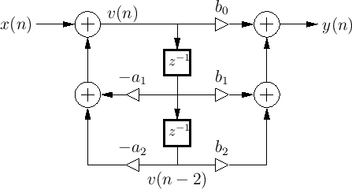

# Infinite Impulse Response Filter Generator
This iir block takes two sequences of coefficients and will generate a direct form II IIR Filter (a generic block diagram is shown below) with a `validWithSync` i/o interface. The generator extrapolates the number of taps from the length of the coefficient sequences. It uses the valid signal to ingest new inputs when valid is high. While it seems trivial, it's importance cannot be overstated because it prevents output instability while applying new signals to the input (in between clock edges). 



### Parameters

```
trait IIRFilterParams[T <: Data] {
  val protoData: T
  val consts_A: Seq[T]
  val consts_B: Seq[T]
}
```

* `consts_A` and `consts_B` refer to the coefficients of the IIR filter.

### Input and Output Ports

The generated IIR Filter has one input and one output port. Both of these are standard `ValidWithSync` interfaces. Internally, `valid` is used to enable the shift register chain, and is also propagated through the block to preserve data validity information. `sync` pin is not internally used but is propagated to provide synchronization information for later blocks.

### Requirements and use notes are noted below:
1) Coefficients_B must be one element larger than Coefficients_A
2) Generate coefficient values in matlab
3) Plug coefficient values as sequences into params
4) To test this block, there is a golden scala implementation of an IIR block in the tests folder. Running SBT test will automatically run the proper tests(currently it tests the generator with UInts and SInts). Keep in mind, with random coefficients, the IIR block will most likely overflow if you run it for too many cycles.
