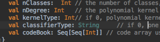

# SVM

## Overview

The SVM block performs classification using the Support Vector Machine algorithm. [`svm_reference.py`](svm_reference.py) models the whole chain (from training all the way to inference/classification). This reference file already implements the final SVM algorithm to be implemented for this project (parametrizable number of classes, different kernel support, and variable number of features).

The SVM implementation for this project will be limited to classification only. In order to perform classification, four inputs are required: 1) The actual input vector of size p x 1, where p is the number of features to be used for classification; 2) The 2D array of support vectors and the corresponding features for those support vectors having a size of s x p, where s is the number of support vectors identified after offline training; 3) The alpha vector which is essentially the weights for each support vector also determined after training, having a size of 1 x s; 4) The intercept that needs to be added after the dot products have been performed, also determined after training.

## Version 1

For the first version, the SVM classifier only performs binary classification (2-class system) and uses a linear kernel. This is the simplest one since the computation ends up to be a simple dot product of the alpha vector (1 x s), the support vectors (s x p), and the input vector (p x 1), plus the intercept. This gives a 1x1 numerical answer that can be positive or negative, which then determines the class where the datapoint corresponding to the input vector belongs to.

## Version 2

For the second version, the classifier will be improved with configurable kernel support. There are two variants of kernels that will be implemented for this project: a polynomial kernel and the radial basis function (RBF) kernel). The linear kernel that was implemented in version 1 is the simplest case of the polynomial kernel. The polynomial kernel raises the dot product of the support vector 2D array and the input vector to some degree (that is also parameterizable). On the other hand, the RBF kernel models the dot product as a Gaussian distribution instead (performing e^-((support - input)^2)). The RBF is actually tricky to implement due to the exponential. So in this implementation, only the exponent is being computed.

## Version 3

The final upgrade for this classifier is to support multi-class classification. SVM on its own is a binary classifier, but by implementing several parallel classifiers, multiple classes can be determined. There are three 'common' approaches to support multi-class classification, as discussed in this link: http://scikit-learn.org/stable/modules/multiclass.html. Here's a brief summary of the classification methods that will be implemented for this project.

One vs all: Say we have 3 classes: a, b, c: We create 3 classifiers. The first classifier classifies a vs (b,c). The second classifies b vs (a,c), and so on. Each of the classifier then votes for the correct classification.

One vs one: Using the same 3 classes, we create a classifier for every pairwise combination of the classes, n(n-1)/2, where n is the number of classes. Then we have voting happening here as well. They say that this is better than one vs all.

Error-correcting output codes: In this approach, each class will be assigned its own unique binary assignment (the number of bits will vary depending on the user). Each bit in this binary assignment will correspond to a classifier. If the number of bits exceed the number of classes, we can be more robust to errors. For more information, check this out: http://scikit-learn.org/stable/modules/generated/sklearn.multiclass.OutputCodeClassifier.html

There’s also a Youtube video that discusses these approaches:
https://www.youtube.com/watch?v=6kzvrq-MIO0
