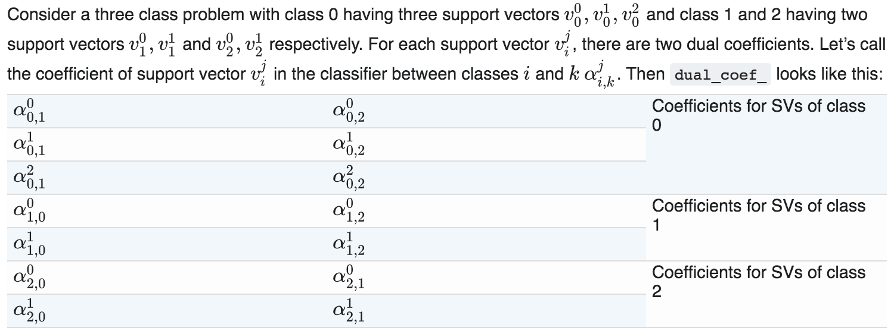
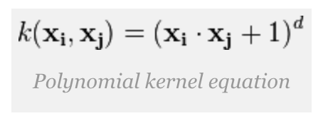
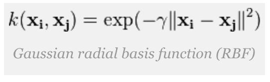

# SVM Classification Crash Course

## Foreword
This is a comprehensive tutorial on using Support Vector Machines for classification. This only includes the detailed computations required to perform inference. Details on training the SVM will not be covered (it is hard, it is very mathy, and it would have been better if an expert in machine learning discusses it). I have written this document as a future reference to someone else who is trying to understand how SVMs perform classification, down in the calculation level. Hope this helps!

## Overview
I will first cover the high-level concept of SVMs, what it does and how it classifies. Afterwards, we'll go into detail on how the classification is performed. I will also reference my [`SVM Python Code`](../scripts/pca_svm/svm_reference.py) which was written to perform classification by manually calculating stuff. This script utilizes the matrices acquired from the SVM training. The manipulation of these matrices to perform classification, instead of relying on the predefined Python libraries, is the main feature of this document. 

## High-level SVM Description

This section covers three things: a high-level description of what SVM does, the kernel trick which enables classification on non-linearly-separable data, and the extension of this binary algorithm for multi-class classification.

### SVM algorithm
The Support Vector Machine algorithm tries to create a dividing line (or in general, a hyperplane) between two classes. This separation allows classification by checking what part of the line the new point belongs to. The line that separates the two classes would be a function of a subset of points from the two classes. In 2-dimensional case, the linear combination of these points would define the slope and intercept of the separating line. Since the separating line depends on these points, the latter are called support vectors, which the namesake of this algorithm. 


### Kernel trick
The barebones SVM algorithm presented before would only create a separating line between two classes. However, for datasets that are not linearly separable, the algorithm will not arrive to a solution. To solve this problem, a kernel trick is used. A kernel is a transformation of the data projection into another dimension which enables the separating hyperplane to curve in the lower dimensional space. There is an [`excellent discussion in Quora`](https://www.quora.com/What-is-the-kernel-trick) regarding this. Instead of transforming the data into a higher dimensional domain, the transformation will be done on the dot products instead (more information regarding the dot product is presented later in this document).


 
There are a lot of possible kernels that can be used for SVMs. The most common ones are the polynomial and the radial basis function (RBF). The math for these two kernel functions will be shown later in this document.

### Multi-class classification

SVM is a binary classifier. Although there is a way to convert the original SVM algorithm from a binary classifier to a multi-class classifier, the math is pretty hard to understand (at least for me). However, there are other tricks to enable multi-class classification, specifically by instantiating multiple binary classifiers and then performing some kind of voting.

There are three general approaches for multi-class classification using multiple classifiers. This [`Youtube video`](https://www.youtube.com/watch?v=6kzvrq-MIO0) introduced me to those which allowed me to explore their implementations in Python, which is detailed in this [`link`](http://scikit-learn.org/stable/modules/multiclass.html). The three approaches are:

* **One vs Rest:** This fits one classifier per class (except for the two-class situation where only one classifier is created, the default SVM algorithm). For each classifier, one class is fitted against the other classes. The final class will be coming from the votes of each classifier.

* **One vs One:** This constructs one classifier per pair of classes. That is, the number of classifiers would be the pairwise combination of all classes in the system: _n(n-1)/2_, where n is the number of classes. As with One vs Rest, the final class is determined from the votes of each classifier.

* **Error-Correcting Output-Codes:** This is a rather different paradigm. Each class would be represented as a unique binary combination of classifiers. That is, each class is represented by a binary code, which is an array of 0s and 1s formed by the classifiers. This mapping of classes to classifiers are contained in a code book which should be indicated at training time. The number of classifiers, therefore, is dependent on the user. Since voting for the final class involves calculating how near the resulting binary code for the new data is to one of the class mappings, the more classifiers there is, the more robust the classification will be.

## SVM Training

### Training using the Python library

This section references the first half of my [`Python code`](../scripts/pca_svm/svm_reference.py). After dividing the dataset into training and test, the SVM algorithm is trained depending on the type of classification to use (refer to the previous section). This uses Python's SVC function defined in `sklearn` library.

```
if class_type == 'ovr': # One vs Rest classification
    clf = OneVsRestClassifier(SVC(kernel=kernel, gamma=1, coef0=coef, degree=degree))
    
elif class_type == 'ovo': # One vs One classification
    clf = SVC(kernel=kernel, gamma=1, coef0=coef, degree=degree)
    
elif class_type == 'ecoc': # Error-Correcting Output-Codes classification
    clf = OutputCodeClassifier(SVC(kernel=kernel, gamma=1, coef0=coef, degree=degree))
    
# Train the model using the training sets
clf.fit(X_train, y_train)
```

### Extraction of matrices

After training, we will need to extract the vectors and matrices that was generated. The important matrices that will be needed for manual computation for classification are the following:

* The support vector 2D matrix: The number of support vectors are determined through training. Since each support vector is an actual training datapoint, it is mapped to the feature space. This forms the 2D matrix of size `nSupports x nFeatures`. 

* The alpha vector: Each support vector has a corresponding weight on how they dictate the resulting equation of the separating hyperplane. These weights can be positive or negative depending on what class the corresponding support vector is mapped to originally (+ for class 1, - for class 0). If this is a multi-class classification, there will be a separate set of weights for the other classifiers. This forms the 2D matrix of size `nClassifiers x nSupports`. 

* The intercept vector: After multiplying the support vectors with its weights, there will be a bias term that needs to be added so shift the separating hyperplane away from the origin. This is the intercept term. For multiple classifiers, there will be a separate intercept term for each. This forms a 1D matrix of size `nClassifiers x 1`. 

The extraction of these matrices are different depending on what type of classification is being performed. The actual challenge is to form these matrices in a consistent fashion so that the calculation of the decision function will be consistent no matter the type of classifier (calculation of the decision function will be discussed in the next section). Specifically, in a multi-classification setup, each classifier will have its own set of support vectors and weights (alphas). The Python script will try to separate these collections. However, if we are aiming for a consistent array format for these three matrices, then all of the corresponding arrays per classifier must be combined (that is, all support vectors per classifier must be combined as a single support vector array, same goes for the alpha and the intercepts). 

The specific steps in extracting these matrices are presented below (only relevant code segments are indicated, check the full code [`here`](../scripts/pca_svm/svm_reference.py)):

#### One vs Rest matrix extraction

The `OneVsRestClassifier()` wrapper in Python creates different classifiers (called estimators) corresponding to the number of classes. More information can be seen [`here'](https://scikit-learn.org/stable/modules/generated/sklearn.multiclass.OneVsRestClassifier.html#sklearn.multiclass.OneVsRestClassifier). The intercept for each of these classifiers is easy to extract. However, the support vectors and the corresponding weights are contained in each of the estimators, which can be indexed. Therefore, creating a collection of support vectors and alphas would require iterating through all these estimators.

```
...
# get the intercept vector
intercept = clf.intercept_

# get initial values of support vectors and alpha, at index 0
alpha_vector[0,support_index[0]:support_index[1]] = clf.estimators_[0].dual_coef_
supports = clf.estimators_[0].support_vectors_

# create the alpha vector and support vector list by iterating through the estimators
for i in range(1,classes):
    alpha_vector[i,support_index[i]:support_index[i+1]] = clf.estimators_[i].dual_coef_
    supports = np.concatenate((supports,clf.estimators_[i].support_vectors_))
    
num_classifiers = classes
...

```

#### One vs One matrix extraction

The `SVC` function in Python performs One vs One classification by default. More information can be seen [`here`](https://scikit-learn.org/stable/modules/generated/sklearn.svm.SVC.html). Extracting the intercept, the support vectors, and its weights are trivial since those become part of the attributes...

```
...
alphas = clf.dual_coef_
supports = clf.support_vectors_
intercept = clf.intercept_
...
```

No, actually not, specifically the alpha (weight) vector. According to this [`documentation`](https://scikit-learn.org/stable/modules/svm.html), the `dual_coef_` attribute arranges the weights in some specified format that saves space (shown below), but complicates computation due to additional processing involved. Rearranging these is rather tedious. 



The first step is to identify the support vector indices, through the `n_support_` attribute, to serve as a guide on how to trim the `dual_coef_` array to correspond with their support vectors. 

```
...
# create the indices for the alpha vector expansion
support_index = np.concatenate(([0],np.cumsum(clf.n_support_)))
...
```

Next is the cool part, we generate an array of the pairwise combinations of classes. You can see this relevance by looking at the pattern shown in the table earlier. These pairwise combinations will be used to mask the `dual_coef_` attribute and extract the alpha vector for each support vector per classifier. **I have never found something like this in the internet**, since all of them just wants to use the built-in `predict` function for classification. But since we want to do the classification manually, this is something that has to be done to make the matrix interpretable and easy to use. 

```
...
# generate the combination maps for the alphas
combo_map = np.zeros((classes,classes-1,2))
for i in range(classes):
    for j in range(i+1,classes):
        # i and j contains the combination
        combo_map[i,j-1] = [i,j]
        combo_map[j,i] = [i,j]

# generate the mask to extract the corresponding alpha array, per combination
# read the sklearn SVC documentation for more details on how the alphas are arranged
# http://scikit-learn.org/stable/modules/svm.html#svm-classification
class_pairs = np.array(list(it.combinations(list(range(classes)),2)))
alpha_vector = np.zeros((len(class_pairs),len(alphas[0])))
...

```

I won't specifically go into details regarding this nested loop, it might require some drawing to describe the algorithm of remapping stuff. If you're interested, understand the original mapping of `dual_coef_` then try walking through this code. Write it out on a piece of paper, look for the pattern!

```
...
for x in range(len(class_pairs)):
    mask_map = np.zeros((classes,classes-1))
    for i in range(classes):
        for j in range(classes-1):
            mask_map[i,j] = (combo_map[i,j] == class_pairs[x]).all()
            if(mask_map[i,j]):
                alpha_vector[x,support_index[i]:support_index[i+1]] = alphas[j, support_index[i]:support_index[i+1]]

num_classifiers = len(class_pairs) # also classes * (classes - 1) /2
...

```

#### Error-Correcting Output-Codes matrix extraction

The `OutputCodeClassifier()` wrapper in Python creates different classifiers based on a code book which maps the classes as a binary combination of classifiers. More information can be seen [`here`](https://scikit-learn.org/stable/modules/generated/sklearn.multiclass.OutputCodeClassifier.html). Since this is a wrapper to the SVC function, extraction of the matrices would be similar to the One vs Rest Classifier. The only difference is that the vector of intercepts for every classifier is not easily accessible as an attribute. Therefore, we must iterate through all the estimators and create the matrices (all three of them).

```
...
# get initial values of support vectors, alpha and intercept, at index 0
alpha_vector[0,support_index[0]:support_index[1]] = clf.estimators_[0].dual_coef_
supports = clf.estimators_[0].support_vectors_
intercept = clf.estimators_[0].intercept_

# create the alpha vector, support vector and intercept list by iterating through the estimators
for i in range(1,num_classifiers): 
    alpha_vector[i,support_index[i]:support_index[i+1]] = clf.estimators_[i].dual_coef_
    supports = np.concatenate((supports,clf.estimators_[i].support_vectors_))
    intercept = np.concatenate((intercept,clf.estimators_[i].intercept_))
...
```

## SVM Classification

This part references the second half of my [`Python script`](../scripts/pca_svm/svm_reference.py). This presents the required calculations to perform manual classification on a new data point given the arrays that were extracted earlier. This is also the reference that is used to create the [`Chisel implementation`](../src/main/scala/svm/svm.scala) of the SVM generator.

### Decision function

In equation form, SVM classification is done by calculating the following sum:


The alpha term corresponds to the support vector weights, as already explained earlier. The y term is the label of the support vector where it belongs (-1 for class 0, +1 for class 1). **The product of this two forms the alpha vector that I have been referring to earlier**. 

The x(i) refers to the support vectors of the classifier, while the x term refers to the new data point. Both of these are an input to a kernel function `K()`. The calculations for this kernel function depends on the type, the two most common forms are the polynomial and radial basis functions (RBF):

* Polynomial kernel: Involves taking the dot product between the support vectors and the new data point and then raising the answer to some degree _d_. By setting _d_ to be 1, then the polynomial kernel reduces to a linear kernel, which is what a bare-bones SVM algorithm does.



```
...
if kernel == 'poly':
    # polynomial kernel, varying degrees
    # if you want linear, set coef = 0, degree = 1
    kernel_dotproduct = np.power((coef + np.matmul(supports,X_test.T)),degree) 
...
```

* Radial Basis Function: Involves taking the square of the Euclidean distance between the support vector and the new data point and then treating it as a negative exponent to an exponential function. This is actually rather complex due to the inclusion of the exponential function. For the SVM generator, only the exponent is calculated.



```
...
elif kernel == 'rbf': # this is so tricky!
    # rbf kernel
    kernel_dotproduct = np.zeros((len(supports),len(X_test)))
    for i in range(len(supports)): # loop for all support vectors
        for j in range(len(X_test)): # loop for all test data samples
            kernel_dotproduct[i,j] = np.exp(-sum((supports[i] - X_test[j]) ** 2))
...
```

Finally, after calculating the product of the alpha vector and the kernel function, the intercept is added to the scalar sum. 

```
...
# kernel_dotproduct will be computed given the test set and support vectors
decision = np.matmul(alpha_vector,kernel_dotproduct)

# add the intercept after doing the dot product with the alphas
decision = decision + np.matmul(intercept.reshape((num_classifiers,1)),np.ones((1,len(X_test.T[0]))))
...
```

In summary, for a multi-class SVM classification, it is simply some function (kernel) of each of the support vectors (`nSupports x nFeatures`) to the new data point (`nFeatures x 1`), multiplied with the alpha vector weights (`nClassifiers x nSupports`) with an intercept being added (`nClassifiers x 1`). The result will be a vector of decision values (`nClassifiers x 1`) which is basically the vote of each classifier on what class the new data point belongs to.

### Voting

After calculating the decision function, the next step is to sum up the votes to finally determine the class of the new data point. For a binary classification, this is trivial (depending the sign of the decision, that is the corresponding class). However, for multi-class classification, the challenge is to sum up the votes for every classifier (which depends on the classification type). This section will present the approaches for voting for each of the classification methods.

#### One vs Rest voting

In a One vs Rest format, voting is simply the class with the highest (positive) vote. While checking just for positivity of the decision value works for a binary classification mode, it might not work if we are considering more than 2 classes. This is because more than one classifier might have a positive vote (maybe the new data point does not uniquely belong to a single class), leading to a tie. To resolve this, the classifier that has the most confidence (i.e. the classifier that has the highest positive vote) should win.

```
...
for i in range(len(X_test)):  # number of test data
    if classes != 1: # there's 1 classifier => binary classification
        y_manual[i] = decision2[i].argmax(axis=0)   # check actual values since there might be a tie
    else:
        y_manual[i] = decision2[i] > 0  # special case for 2 classes
...

```

#### One vs One voting

In a One vs One format, voting is a bit tricky. Looking back to the One vs One implementation, this creates classifiers to classify all pairwise combination of classes. Therefore, each classifier can only vote on either one of the two classes, depending on what combination it is checking. The `class_pairs` vector that was created for the matrix extraction is used again in this code block to map the vote to one of the two classes per classifier. The total votes per class will then be summed up and the class with the highest number of votes wins. To avoid potential ties, the raw values of the decision function can also be used instead of just checking for positivity.

```
...
vote = decision > 0
for i in range(len(X_test)):
    for j in range(num_classifiers):
        if classes > 2:     # binary classification is a special case since that only has 1 classifier
            vote[i][j] = class_pairs[j][1-vote[i][j]]
        else:
            vote[i][j] = class_pairs[j][vote[i][j]]
        # I did 1-x since 1 must correspond to the first of the pair
        # this is just index manipulation, 0 -> 1, 1 -> 0
        
    # find the max votes, that will be the final class
    y_manual[i] = max(set(vote[i]), key=vote[i].count)
...
```

#### Error-Correcting Output-Codes voting

In the Error-Correcting Output-Code format, the voting scheme is a little different. Each of the classifiers will output a binary decision (depending on the sign of the decision function). This then forms a vector of 0s and 1s. This vector is now matched to the code book. Some distance metric will be used to find the class corresponding to the vector it closely matches. 

One approach is to calculate the hamming distance, calculating how many bits matches. The main reference would be the entry of the code book, which should have been identified during the training phase. After calculating the amount of similarity between each codebook entry, the class corresponding to the highest sum would win.

```
...
vote = decision > 0
for i in range(len(X_test)):
        for j in range(classes):
            tempvote[i][j] = sum(vote[i] == codes[j]) # hamming distance of every data to the code book 
            
        y_manual[i] = tempvote[i].argmax(axis=0) # pick the class with the largest hamming distance, will there be a tie?

...
```

Another approach, which is the actual approach being used by the Python library, is to calculate the Euclidean distance. The problem with this approach, however, is complexity, since it requires a square root function for the actual distance measurement. What can be done instead is to leave out the square root and just sum the square differences. This can lead to some inaccuracies between the Python library output and the manual calculation, but it should not be too drastic. 

```
...
codes[codes == 0] = -1  # get distance to [-1,1] not [0,1]

# let's try creating a pseudo euclidean distance metric
for i in range(len(X_test)): # number of test data
    for j in range(classes):
        tempvote[i][j] = -1*sum(np.power(decision2[i] - codes[j],2)) # sum of squares, instead of euclidean
        
    y_manual[i] = tempvote[i].argmax(axis=0) # pick the maximum number, the least negative
...
```

Here is the Euclidean distance implementation, if you're interested. The output of this should match the Python `predict` function.

```
y_manual = euclidean_distances(decision2,codes).argmin(axis=1)
```

## End